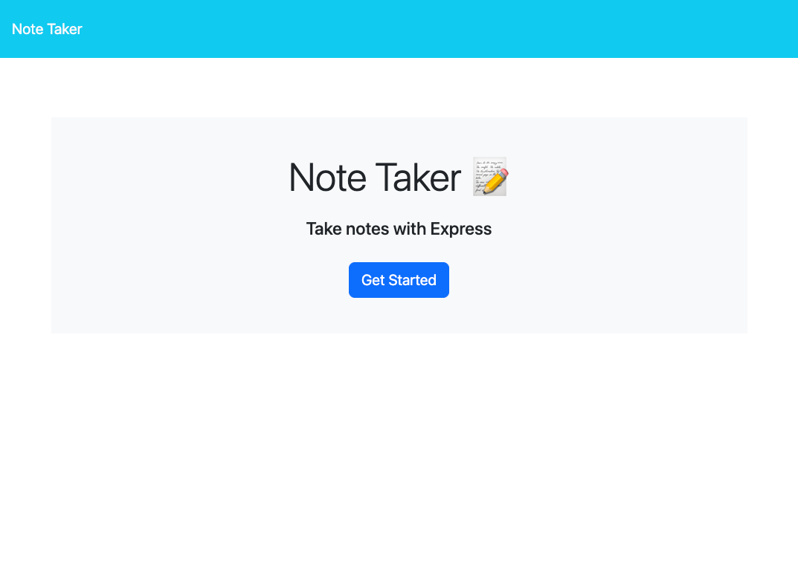
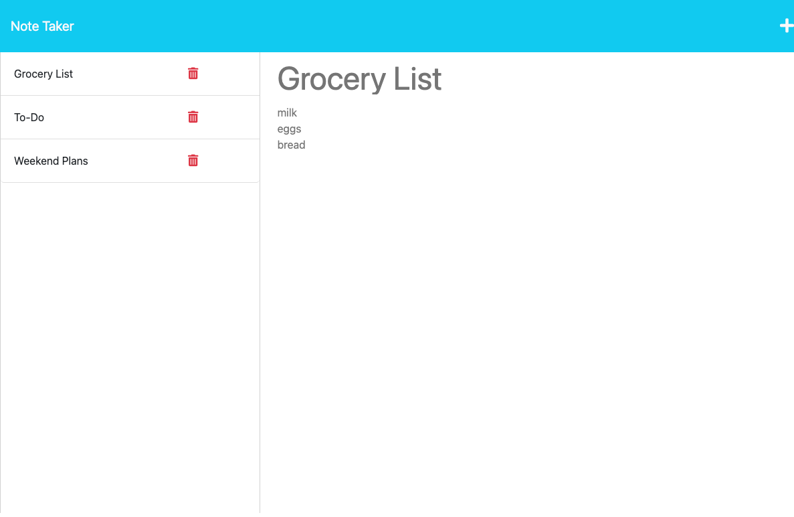
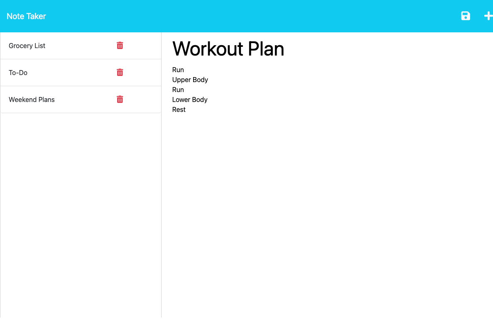
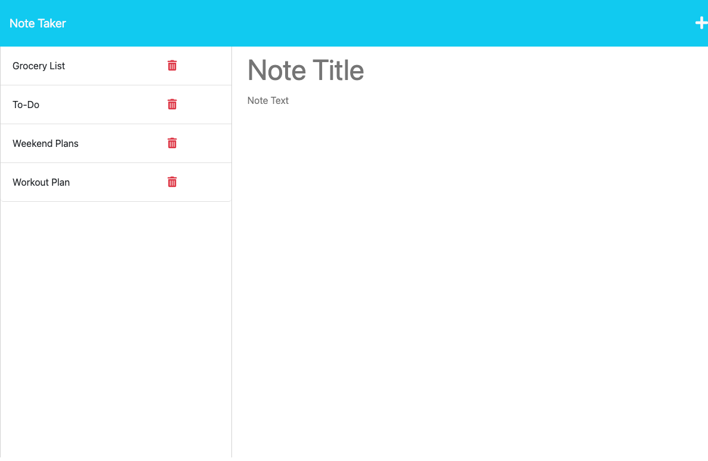
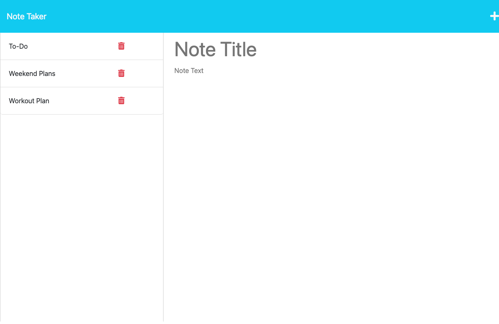

# Quick Note Taker

## Description

This application is a simple and quick note taker. The application displays notes saved in a database deployed on Heroku. The user has the ability to view previously created notes, make new notes and delete old notes!

This project required a strong understanding of JavaScript as well as utilizing that JavaScript with Express.js. Constructing this application taught me a lot about Express.js and how servers work. Modularizing the routes, the server.js and the front end on this small application is a good introduction to how all the necessary modules connect and work together.

## Table of Contents

- [Installation](#installation)
- [Usage](#usage)
- [Credits](#credits)
- [License](#license)
- [How to Contribute](#how-to-contribute)

## Installation

To use this applcation, clone the project directories and files from [the repository](https://github.com/sillytsundere/quick-note) and open the quick-note repo in preferred code editor. Install the dependent modules (express.js, uuid) using npm install with Node.js. Finally start the server with Node.js and visit the localhost:3001 to view the application and experiment with it's functionality.

## Usage

Once at the notes HTML page (localhost:3001/notes) previously saved notes will be displayed on the left hand side and clicking one will display the note title and the note text in the note space on the right hand side. 

Users can click the plus sign on the top right of the page to begin a new note and once finished can click the save icon next to the plus icon at the top right to save the new note to the database. Once saved the new note will appear with the previous notes on the left hand side.

To delete a note the user can decide which note they would like to remove and click the trash icon next to that note in the left hand column and the note will clear from the log of saved notes.

## Credits

Source code was obtained from [The Coding Bootcamp](https://github.com/coding-boot-camp/miniature-eureka)

Badges sourced from: [Awesome Badges](https://dev.to/envoy_/150-badges-for-github-pnk)

## License

## Badges

## How to Contribute

If you have any questions or would like to contact me please reach out to me at [My GitHub Page](https://github.com/sillytsundere).
